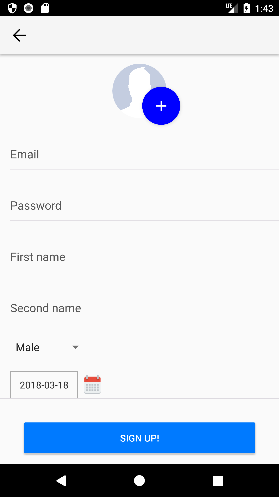
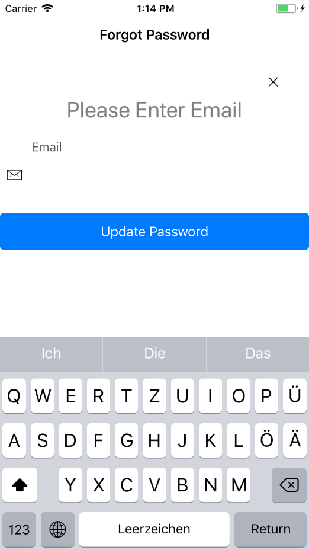
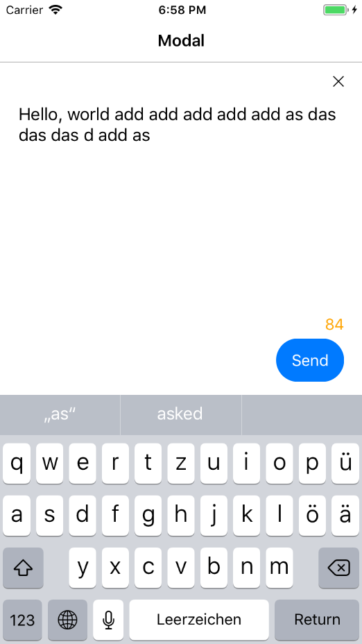
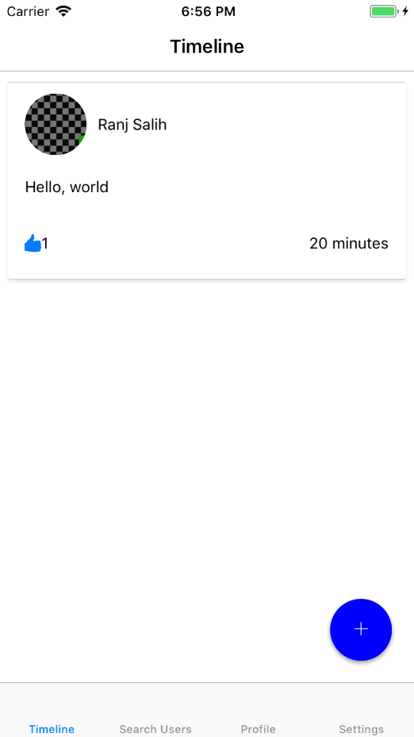

# Dissertation Project
This project utilises Firebase and React Native to re-create the core functionalities of Twitter, on both Android and iOS.

Below are some of the main features that the app contains.

Login Page       | Create Account Page
------------- | -------------
  | 

Forgot Password Page       | Tweet Page
------------- | -------------
  | 

Forgot Password Page       | 
------------- | 
 |
